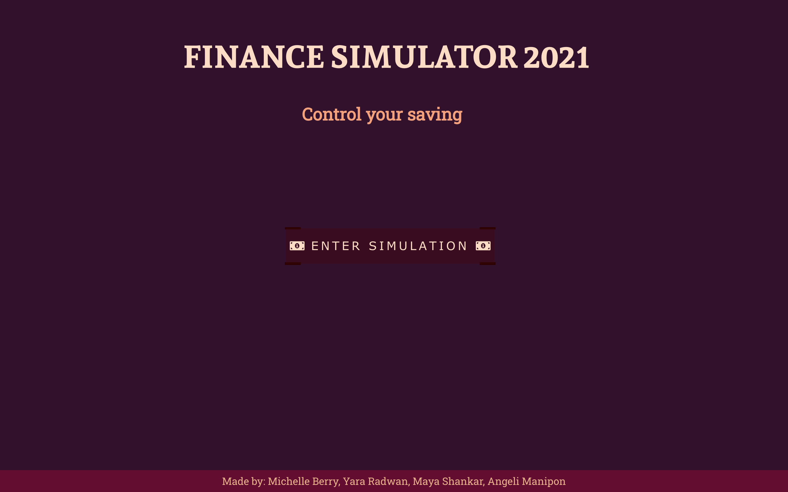
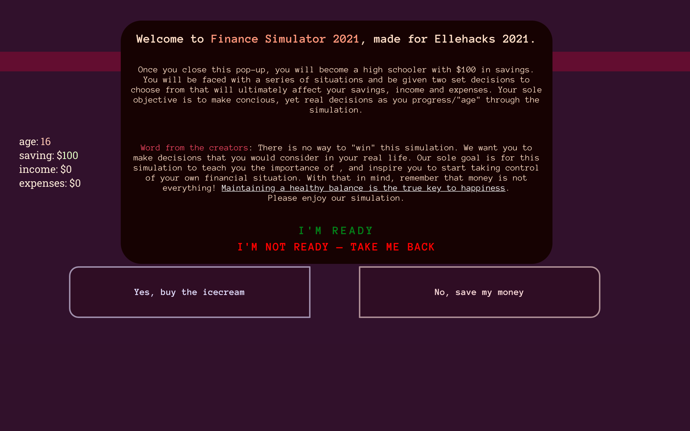
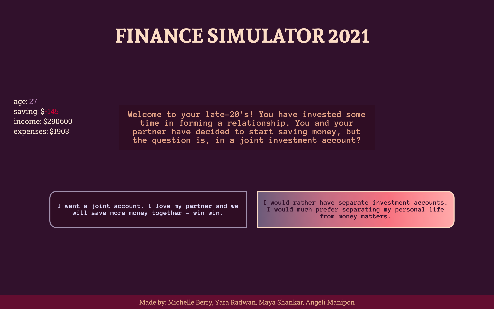
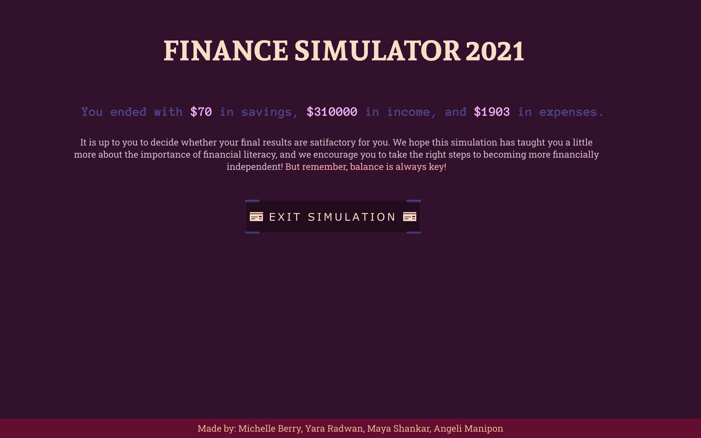

#  Finance Simulator 2021

A simulation to help youth understand the importance of financial literacy. 👾🤓 Made for Ellehacks 2021! 👩🏻‍💻👩🏽‍💻  <br />
Finalist for Ellehacks 2021 and Recipient of the Rogers Custom Award! (and placed third for Bell's Custom Award too!)

## 💵 Description 💵

Finance Simulator 2021 is a simulator that allows users to experience real life situations and make decisions that affect their spending and saving. The more financially literate decisions you make, the better off you will become as you progress through the levels (representing different stages of life).

## 💴 Navigation 💴

When you first enter the web-app, you are greeted with a spunky landing page. Once you click the <b>START SIMULATION</b> button, a pop-up with the instuctions and a few words from the creators (us!) will appear. After you close the pop-up, the simulation will officially begin. <br/>
You will start out as a high schooler with a few hundred dollars saved. You will be able to track your level and amount at anytime on the left side. You will go through several situations that will require you to make a decision to spend. After you finish a certain number of situations, you will 'level up' to become a university/college student, and then again to become a working adult. Based on real statistics, you will be forced to spend money on rent, food, and other necessaties. Once you have completed the simulation, you will be able to view your final amount saved. A final message will appear from the creators (us, again!) highlighting the importance of maintaining a balance and making smart, concious financial decisions. <br/>
There is no way to "win" the game: Our end-goal is to solely illuminate the benefits of being financially literate and inspire the user to take control of their own financial situation. We believe that finishing the simulation with the maximum amount of money is not all there is to life. It is up to the user to determine the value of their end-result and make their real-life changes accordingly. <br/>
### Tech Requirements
Our app is currently not hosted on a domain. For the time being, you may download the repo, run EllehacksApplication.java and then, in the frontend folder path, run our React app by entering ```yarn start``` in your terminal.<br/>

In the meantime, you may view a virtual tour of our product below, or <a href="https://youtu.be/iTpVSSHqkcA">watch our demo</a> instead!

<p align="center"><sup><i>Landing page</i></sup></p>


<p align="center"><sup><i>Instruction pop-up when user starts simulation.</i></sup></p>


<p align="center"><sup><i>Sample question given in the simulation.</i></sup></p>


<p align="center"><sup><i>Results page when user completes the simulation.</i></sup></p>


## 💶 Inspiration 💶

We, the creators, were inspired to make the game after realizing the evident gap in students' knowledge when it comes to financial literacy. Often, many of the decisions (or lack of) we make as univeristy students will affect our future and may hinder our ability to become financially stable or secure. We wanted to make a simulation that would be engaging for the user, but also teach some very important lessons. We were inspired by the infamous <a href="https://www.episodeinteractive.com/">Episode</a> app to create a simulation that is based on scenarios and decisions that the user has to make that affects their final outcome, for better or <i>for worse</i>.

## 💷 Tech Stack 💷

We created Finance Simulator 2021 using a React front-end and Java Springboot back-end.
For the front-end, we also used Chakra-UI components.<br/>
Special credits to <a href="https://www.youtube.com/watch?v=5RA5NpxbioI">this youtube video</a> for a stellar tutorial on how to create a React-Java Springboot web-app, and for <a href="https://codepen.io/Eslam_Refa3y/pen/gOYrxrq">this awesome button template </a> we took inspriation from!

## 💳 What We Learned 💳

Through creating the Finance Simulator we learned about how important basic financial literacy may be to a person's life; While researching for sample scenerarios to provide, we learned various accounting terms and several tips to become more financially sercure.<br />
This happened to be the first hackathon two of us have participated in, and definitely the first virual hackathon for all of us! Ellehacks 2021 taught us how to work together and maintain constant communication despite being in a remote setting! 

## 💸 Challenges Faced 💸

Since one of our members lives in a different timezone, we found it difficult to arrange meeting times that were convenient for all of us. It was also a challenge deciding what technologies to use to implement the game, since we all have vastly varying skill sets. This was  the very first time for several members to use Java Spring and React, so it was a real challenge learning all the necessary tech in time to create a stunning final product. Overall, we are all extremely proud of our work and hope others may find great use in Finance Simulator 2021!

## 💰 Next Steps 💰

Though it is surely important to save money, we also believe balance is key. Though a user, who has the sole aim of being financially stable, may choose to opt out of any events that may require them to spend, they might also lose out on forming any sort of interpersonal relationship and lack a social life. Thus, a future improvement to our simulation is to factor in certain variables, such as the number of friends you make/lose. <br/>
Another feature we heavily considered is the inclusion of different routes, since we recognize not everyone is the same. Some might want to pursue a post-secondary education, while others may not. Different routes would allow different users to find relevant and important information to pertain to their own life adventures. We also would like to incorporate the theme of luck, as we all know sometimes, events are 100% out of our control. <br />
